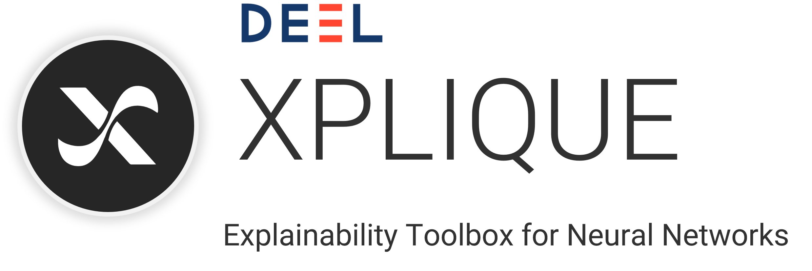

# HSIC Attribution Method

This repository contains code for the paper:

*Making Sense of Dependence: Efficient Black-box Explanations Using Dependence Measure*, Paul Novello, Thomas Fel, David Vigouroux, NeurIPS 2022.

The code is implemented and available **for Tensorflow**. 
A notebook is available: [notebook Tensorflow](./tensorflow_example.ipynb).

**Update 14/12/2022:** The method is now available in [Xplique](https://github.com/deel-ai/xplique), an awesome XAI library that has been used for all the experiments found in the paper.
[](https://github.com/deel-ai/xplique).

## Content

### Notebook 

The notebook allows to run the code for:

* Classical classification explanations
* Interactions in classification explanations

The images are taken from ImageNet and the model used is a ResNet50.

### Object detection

Visualizations of object detection explanations with YOLOv4 for the first 40 images of COCO dataset are found in a `zip` file at [./assets/coco_viz_select.zip](./assets/coco_viz_select.zip).

## Other Attribution methods

The code for the metrics and the other attribution methods used in the paper come from the [Xplique toolbox](https://github.com/deel-ai/xplique).

## Authors

Paul Novello, DEEL team, Artificial and Natural Intelligence Toulouse Institute; IRT Saint-Exupéry

Thomas Fel, DEEL team, Artificial and Natural Intelligence Toulouse Institute; Carney Institute for Brain Science, Brown University

David Vigouroux, DEEL team, Artificial and Natural Intelligence Toulouse Institute; IRT Saint-Exupéry

## Citation

```
@inproceedings{novello_hsic_attribution,
 author = {Novello, Paul and Fel, Thomas and Vigouroux, David},
 booktitle = {Advances in Neural Information Processing Systems},
 title = {Making Sense of Dependence: Efficient Black-box Explanations Using Dependence Measure},
 volume = {35},
 year = {2022}
}
```
